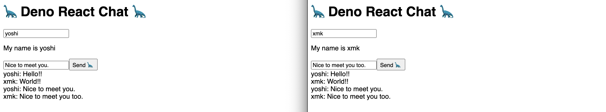

# Deno react chat
Real-time chat using React, deno-react-base-server and Websocket. All in one Typescript.


## Getting started
```Shell
$ deno run --allow-net --allow-read https://denopkg.com/yoshixmk/deno-react-chat/mod.ts
```
will launch on http://localhost:5000/

### Default settings
- react based web server => 5000 port
- Websocket => 8080 port
- Localhost only work

### Help
```Shell
$ deno run https://denopkg.com/yoshixmk/deno-react-chat/mod.ts -h
```

## Starting at Local
Another way, clone this src at local environment, and execute it.  
Clone this and exec bellow.
```Shell
$ deno run --allow-net --allow-read mod.ts
```
